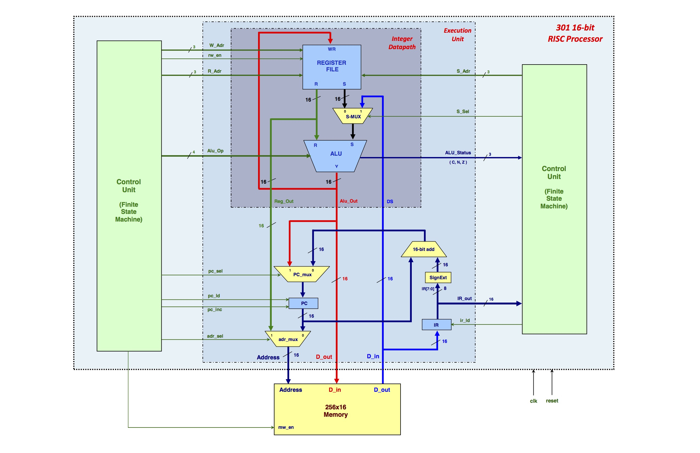

# 16-bit RISC Processor
>A 16-bit Reduced Instruction Set Computing(RISC) processor designed using the Verilog harware description language(HDL). The design was implemented on a Nexys 4 DDR board using the Xilinx Artix-7 Field Programabble Gate Array(FPGA). The processor is capable of fetching and executing a set of 16-bit machine instructions. 
### Schematic:

#### Memory Structure
* 256 x 16 address space
* Each memory location contains one 16-bit word
#### Processor Register Set
* Eight 16-bit integer registers (R0, R1, R2, R3, R4, R5, R6, R7) 
* 16-bit program counter (PC)
* Flags Register (N, Z, C) 
#### Data Types 
* 16-bit word signed integer (-32768 :arrow_right: 32767) 
#### Addressing Modes 
1. Immediate 
2. Register 
3. Register Indirect 
4. PC relative
#### Instruction Opcodes
Basic format for instructions: 

| opcode         | dest_reg      | src1_reg       | src2_reg      |
| :-------------:|:-------------:| :-------------:|:-------------:| 
| `bits 15 -> 9` | `bits 8 -> 6` |`bits 5 -> 3`   |`bits 2 -> 0`  |

`Double-Source Operands` &nbsp;&nbsp;&nbsp; `dest_reg` :arrow_left: `src1_reg` __operation__ `src2_reg`

| Name          | Opcode        | 
| ------------- |:-------------:| 
| add           | 111-0000      | 
| sub           | 111-0001      | 
| cmp           | 111-0010      | 

`Single-Source Operands` &nbsp;&nbsp;&nbsp; `dest_reg` :arrow_left: __operation__ `src2_reg`

| Name          | Opcode        | 
| ------------- |:-------------:| 
| mov           | 111-0011      | 
| shl           | 111-0100      | 
| shr           | 111-0101      | 
| inc           | 111-0110      | 
| dec           | 111-0111      | 

`Load, Store & Halt`

| Name          | Opcode        | 
| ------------- |:-------------:| 
| load          | 111-1000      | 
| store         | 111-1001      | 
| loadi         | 111-1010      | 
| halt          | 111-1011      | 

`Jumps`

The address for conditional jump instructions is calculated by adding the 16-bit sign-extension of an 8-bit signed offset to the program counter. 

| opcode         | 0             | 8-bit signed offset |
| :-------------:|:-------------:| :-------------:|
| `bits 15 -> 9` | `bit 8`       |`bits 7 -> 0`   |

The address for unconditional jump instructions is specified by the contents of src2_reg. 

| opcode         |       |       | src2_reg      |
| :-------------:|:-------------:| :-------------:|:-------------:| 
| `bits 15 -> 9` | `bits 8 -> 6` |`bits 5 -> 3`   |`bits 2 -> 0`  |

| Name          | Opcode        | 
| ------------- |:-------------:| 
| je            | 111-1100      | 
| jne           | 111-1101      | 
| jc            | 111-1110      | 
| jmp           | 111-1111      | 

